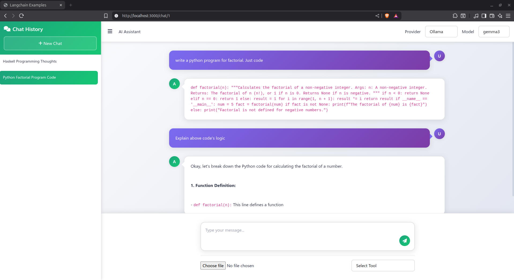

# 🧠 ai-chatbot-hs



A simple AI chatbot (ChatGPT clone) built entirely in **Haskell**.

* 🌐 **Frontend**: [Hyperbole](https://github.com/seanhess/hyperbole)
* 🤖 **AI Integration**: [langchain-hs](https://github.com/tusharad/langchain-hs)
* 🗃️ **Database**: [`sqlite-simple`](https://hackage.haskell.org/package/sqlite-simple)

---

## ✨ Features

* ✅ Multi-conversation chat history
* 🔀 Switch between different models/providers (e.g., **Ollama**, **OpenRouter**)
* 📎 Upload and query documents (plain `.txt` only for now)
* 💅 Clean, minimal UI
* 🔧 Tool calling support (e.g., **Web search**, **Wikipedia**)
* 📝 Markdown rendering of messages

---

## 🚀 Getting Started

### 1. Clone the Repository

```bash
git clone https://github.com/your-username/ai-chatbot-hs.git
cd ai-chatbot-hs
```

### 2. Run with [Stack](https://www.haskell.org/ghcup/)

```bash
stack run
```

The application will be available at: [http://localhost:3000](http://localhost:3000)

---

## ⚠️ Prerequisites & Notes

1. **Model Setup**:

   * The model selector in the dropdown is currently hardcoded.
   * Ensure you have [Ollama](https://ollama.com) installed and the following models pulled:

     * `nomic-embed-text` (used for embedding uploaded documents)

2. **Package Versions**:

   * If you're **not using Stack**, ensure the following dependencies are pinned to their **latest Git commits**:

     * [`langchain-hs`](https://github.com/tusharad/langchain-hs)
     * [`ollama-haskell`](https://github.com/tusharad/ollama-haskell)
     * [`hyperbole`](https://github.com/seanhess/hyperbole)
   * Versions on Hackage may be outdated and may not work as expected.

---

## 📄 License

MIT — feel free to fork and modify.
