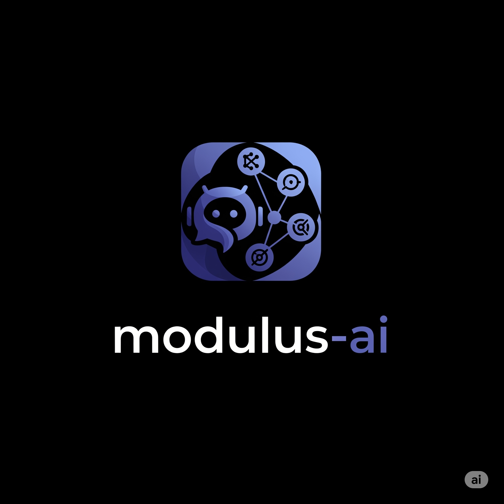
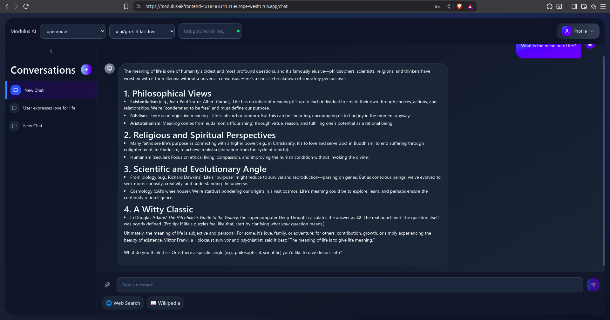

# modulus-ai

<div style="text-align: center;">

</div>


Modulus-AI is a multi-provider chat platform that offers premium, customizable user experiences. Providing a seamless integration with various AI models, it allows users to interact with multiple AI providers through a single interface. Advance tool usage such as web-search and wiki-search is supported as well as customizable RAGs, enhancing the capabilities of the AI interactions.

## Features

- Multi-provider chat interface (Ollama, OpenRouter)
- Premium user interface

## Screenshots



## Technology Stack

- **Backend**: Haskell, Servant, PostgreSQL
- **Frontend**: React, Typescript, Vite, TailwindCSS
- **CI/CD**: GitHub Actions
- **Code Quality**: Pre-commit hooks, HLint, fourmolu
- **Deployment**: [GCP](https://modulus-ai-461848834131.europe-west2.run.app/)
- **Model Serving**: Ollama, OpenRouter
- **Email Service**: [Mailgun](https://documentation.mailgun.com/docs/mailgun/api-reference)

## Local Development setup

### Prerequisites

- Docker
- Docker Compose
- [Stack](https://www.haskell.org/ghcup/) 
- Pre-commit
- Mailgun API
- Ollama (optional, for local model serving)

### Step 1: Clone the repository and navigate to the project directory

```bash
git clone git@github.com:tusharad/modulus-ai.git
cd modulus-ai
```

### Step 2: Go to be directory to run backend

```bash
cd modulus-ai-be
```

### Step 3: Setup environment variables

```bash
source export-env.sh
```

This will add the necessary environment variables to your shell session from the `.env.local` file. You must create this file based on the `.env.example` file provided in the repository.

### Step 4: Up the Docker containers

```bash
make up
```

This command will start the Docker containers defined in the `docker-compose.yml` file. It will set up the necessary services for the application to run including postgres database.

### Step 5: Run the application

```bash
stack run
```

This command will start the application using Stack, which is a tool for managing Haskell projects. It will compile the project and run the server.

The application should now be running and accessible at `http://localhost:8081`.

### Step 5: Run tests

```bash
make tests
```

### Step 6: Change directory root to fe

```bash
cd modulus-ai-fe
```

### Step 7: Run UI

```bash
npm install
npm run dev
```

## Kanban Board

[](https://trello.com/b/00d4t0Kl/modulus-ai)

## License

This project is licensed under the MIT License - see the [LICENSE](LICENSE) file for details.

## Contributing

Contributions are welcome!